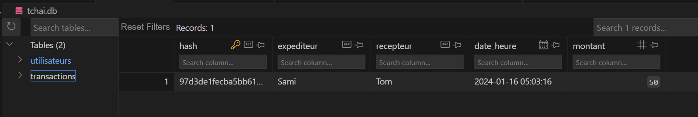
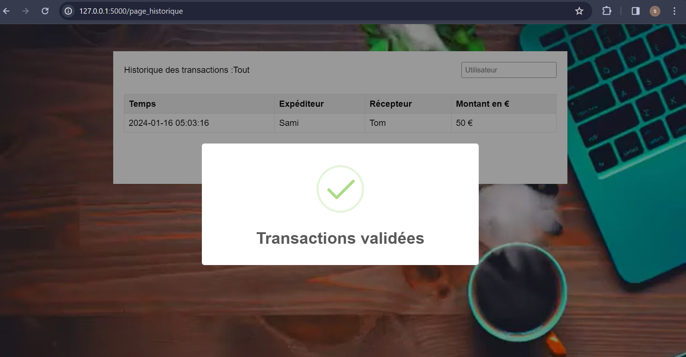
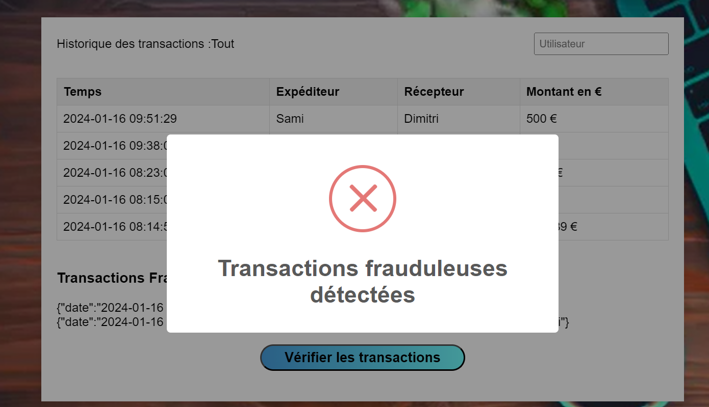

# TCHAI-SAMI-EZZAHID
Systèmes d’information avancés. Projet TP

# Systèmes d’information avancés - Projet TP

## Réalisé par : 
- **Sami EZZAHID** 
  - 5A - IE -ILC 
  - [sami_ezzahid@etu.bourgogne.fr](mailto:sami_ezzahid@etu.bourgogne.fr)

## Introduction

L'objectif de ce projet est de créer un logiciel de gestion de transactions électroniques avec une intégrité garantie, accessible via le protocole **HTTP**.

### Technologies Utilisées

- **Front-end :** HTML, CSS, JavaScript
- **Back-end :** Python, Flask
- **Base de Données :** SQLite

Les données sont enregistrées dans un fichier nommé "**tchai.db**".

## Tchaî V_1

### Exercice 1 : Fonctions Préliminaires

Une transaction est définie comme un tuplet (P1, P2, t, a), où a est la somme d’argent transférée de P1 à P2 au moment t.

#### (A0) : Page Connexion/Inscription

Nous commençons par définir une page de **connexion/inscription** pour enregistrer et identifier les utilisateurs avec les éléments suivants : 
- Un nom d'utilisateur.
- Un mot de passe.

Cette étape est essentielle pour initialiser les soldes des utilisateurs.

````python
def creer_base_de_donnees():
    conn = sqlite3.connect('tchai.db')
    cursor = conn.cursor()

    # Création de la table des utilisateurs
    cursor.execute('''
        CREATE TABLE IF NOT EXISTS utilisateurs (
            nom  TEXT UNIQUE PRIMARY KEY NOT NULL,
            password TEXT NOT NULL,
            solde REAL DEFAULT 0.00
        )
    ''')

    # Création de la table des transactions (on défini le montant avec decimal et non pas real ôur éviter la suppréssion des zéros après la virgule)
    cursor.execute('''
        CREATE TABLE IF NOT EXISTS transactions (
            hash TEXT NOT NULL PRIMARY KEY ,
            expediteur TEXT NOT NULL,
            recepteur TEXT NOT NULL,
            date_heure DATETIME NOT NULL,
            montant FLOAT NOT NULL
        )
    ''')
    # Enregistrement
    conn.commit()
    conn.close()
````


Voici la page de connexion/inscription qui permet de faire les deux tâches dans la même page grâce à un curseur :


#### (A1) - (A4) : Enregistrement d'une transaction 

Voici la page d'enregistrement des transactions :


La page d'enregistrement des transactions comprend :
- Un formulaire pour saisir le nom de l'expéditeur (prédéfini depuis la phase de connexion), le nom du récepteur et le montant de la transaction.
- Affichage du solde de l'utilisateur connecté.
- Bouton pour enregistrer la transaction.
- Bouton pour basculer vers la page d'affichage de l'historique des transactions.

Lorsque la fonction "enregistrerTransaction()" est déclenchée, les données sont récupérées depuis la page HTML et ensuite envoyées sous format JSON au serveur Flask grâce à une requête Fetch HTTP. La route Flask "route_transaction" récupère les données, vérifie si les noms entrés existent dans la table utilisateurs, puis met à jour le solde de chaque utilisateur et enregistre la transaction dans la table transactions.

#### (A2) - (A3): Affichage des transactions

Voici la page de l'historique des transactions :


La page affiche dans une table les données retournées par la route Flask "route_historique". La page possède également un input situé au-dessus de la table pour entrer le nom de l'utilisateur et filtrer les transactions affichées liées à un certain utilisateur.

Le code utilise la requête SQL suivante pour filtrer les données à sélectionner selon le nom d'utilisateur : 


cursor.execute('SELECT date_heure, expediteur, recepteur, montant FROM transactions WHERE expediteur = ? OR recepteur = ? ORDER BY date_heure DESC', (utilisateur, utilisateur))
        transactions = [{'date_heure': row[0], 'expediteur': row[1], 'recepteur': row[2], 'montant': row[3]} for row in cursor.fetchall()]

## Exercice 4 : Attaque de la base de données

- Nous utilisant le terminal pour se connecter à la bdd sqlite3 et récupérer une ligne pour determiner la valeur de la clé primaire. en suite , la requete suivant met ajour les données sans que cette fail soit detécter par notre système : 

````shell
PS C:\Users\test\Desktop\TP Projet Syst info avance> sqlite3 tchai.db "SELECT * FROM transactions ORDER BY date_heure DESC LIMIT 1;"
17|sami|sami_recep|2024-01-14 18:11:26|0.04
PS C:\Users\test\Desktop\TP Projet Syst info avance> sqlite3 tchai.db "UPDATE transactions SET montant = 150.0 WHERE id = 17;"
PS C:\Users\test\Desktop\TP Projet Syst info avance> sqlite3 tchai.db "SELECT * FROM transactions ORDER BY date_heure DESC LIMIT 1;"
17|sami|sami_recep|2024-01-14 18:11:26|150.0
PS C:\Users\test\Desktop\TP Projet Syst info avance>
````


## Tchaî V_2

## Exercice 5 : Hashage

- Nous ajoutons maintenant le hashage d'une transaction dans son tuple. Nous utilisons le hashage SHA-256 (Secure Hash Algorithm 256 bits) : 
  - Les informations sensibles (expéditeur, récepteur, date, montant) sont concaténées dans une chaîne.
    Les chaînes sont encodées en bytes (encode('utf-8')) pour être compatibles avec l'algorithme de hachage.
    Utilisation de SHA-256 :

  - hexdigest() convertit le résultat du hachage en une représentation hexadécimale. Cela retourne le résultat du hachage sous forme d'une chaîne hexadécimale, qui est plus lisible et largement utilisée pour représenter des hachages.

Avantages de SHA-256 :

  Sécurité : SHA-256 est considéré comme sécurisé et résistant aux attaques connues.
  Taille du hash : La taille du hash (256 bits) offre une grande résistance aux collisions, rendant les attaques par force brute plus difficiles.
  Utilisation généralisée : SHA-256 est largement utilisé et accepté comme un choix standard dans de nombreuses applications.

````python

        # Concaténez le hash précédent avec les autres données de la transaction
        hash_input = f"{expediteur}_{recepteur}_{temps}_{montant}".encode('utf-8')

        # Utiliser l'algorithme SHA-256 pour calculer le hash
        sha256 = hashlib.sha256()
        sha256.update(hash_input)
        hash = sha256.hexdigest()

        cursor.execute('''
            INSERT INTO transactions (hash, expediteur, recepteur, date_heure, montant)
            VALUES (?, ?, ?, ?, ?)
        ''', (hash, expediteur, recepteur, temps, montant))

        # Validez la transaction dans la base de données
        conn.commit()
        conn.close()
````

## Exercice 6 : Route Flask de vérification

- Nous avon définie une une route flasque de vérification des transaction dans l'API du logiciel accessible par une requete HTTP GET. le but et de vérifier s'il ya des transactions frauduleuses dans la BDD où des informations de la transactont ont étaient modifiées, et cela en recalculant le hashe de chaque ligne et le comparant avec le hash enregistré dans la table : 

````python
 for transaction in transactions[1:]:
            # Extraire les informations de la transaction
            hash_enregistre, expediteur, recepteur, date, montant = transaction
            # Utiliser format() pour formater la valeur avec deux chiffres après la virgule (round(montant, 2)
            montant = "{:.2f}".format(montant)

            # fonction qui retourne le Calcule du hash des informations actuelles
            hash_calculé = calculer_hash(cursor,i,expediteur, recepteur, date, montant)
            i+=1

            # Vérifier si le hash enregistré correspond au hash calculé
            if hash_calculé != hash_enregistre:
                transactions_frauduleuses.append({
                    "expediteur": expediteur,
                    "recepteur": recepteur,
                    "date": date,
                    "montant": montant
                })

        conn.close()
````



*



## Exercice 7 : Test 

On verfie si l'attaque de modifiaction des données des transactions est détecté par notre système de vérification :

````shell
PS C:\Users\test\Desktop\TP_Tchai> sqlite3 tchai.db "update transactions set montant = 888889 WHERE  hash = '9b9bd5b98dfa7432bfbdc6acac1006fb8124769255e71e62023bd84c0674bb27';"
PS C:\Users\test\Desktop\TP_Tchai>
````


## Exercice 8 : suppresion d'une ligne entière.

- Pour vérifier l'efficacité de notre système nous essayons de supprimer une ligne entière en attaquant directement la BDD et on obd=serve que rien n'est detecté !!

````shell
PS C:\Users\test\Desktop\TP_Tchai> sqlite3 tchai.db "DELETE FROM  transactions WHERE  hash = 'd0a52ad18a304fd61e580d1ea66977074838d5b52178d6151c6718c1688b1224';"
PS C:\Users\test\Desktop\TP_Tchai> sqlite3 tchai.db "DELETE FROM  transactions WHERE  hash = '904ad049677c89c9503e6c3c81c8078cd369416e32e1ece59ae430cbb631b63e';"
PS C:\Users\test\Desktop\TP_Tchai> 
````

* 


##  Tcai V_3

## Exercice 9 : Ajout du hash précédent

- Nous améliorons notre système de detection de transavtion frauduleuse.
- Nous ajoutons le hash de la transaction précédent pour faire le hash de la transaction actuelle. ce qui forme le pricipe de ** Block-Chain ** et donc les transaction sont liées entre eux et la moidre modification cassera cette chaire et déclachera une erreure.

- Pour récupérer le hash précédent à chaque transaction nous utiliserons le nombre de l'interation pour determiner le 'OFFSET de la requete sql qui recumpérer les données dans l'ordre croissant et récupére une seule ligne.

````python
def calculer_hash(cursor, iteration, expediteur, recepteur, temps, montant):
    # Concaténer les informations de la transaction
    # Récupérez le hash de l'avant-dernière transaction en utilisant l'offset dynamique
    cursor.execute(f'SELECT hash FROM transactions ORDER BY date_heure ASC LIMIT 1 OFFSET {iteration}')
    avant_dernier_hash = cursor.fetchone()
    avant_dernier_hash = avant_dernier_hash[0] if avant_dernier_hash else str(uuid.uuid4())  # Utilisez un UUID si c'est la première transaction

    # Concaténez le hash précédent avec les autres données de la transaction
    hash_input = f"{avant_dernier_hash}_{expediteur}_{recepteur}_{temps}_{montant}".encode('utf-8')
    print(hash_input)

    # Utiliser l'algorithme SHA-256 pour calculer le hash
    sha256 = hashlib.sha256()
    sha256.update(hash_input)
    return sha256.hexdigest()
````

En euite, cette valeur est utilisée pour recalculer le hash et le vérifier avec le hash enregistré : 

````python
cursor.execute('SELECT * FROM transactions')
        transactions = cursor.fetchall()

        transactions_frauduleuses = []
        
        i=0
        for transaction in transactions[1:]:
            # Extraire les informations de la transaction
            hash_enregistre, expediteur, recepteur, date, montant = transaction
            # Utiliser format() pour formater la valeur avec deux chiffres après la virgule (round(montant, 2)
            montant = "{:.2f}".format(montant)

            # fonction qui retourne le Calcule du hash des informations actuelles
            hash_calculé = calculer_hash(cursor,i,expediteur, recepteur, date, montant)
            i+=1

            # Vérifier si le hash enregistré correspond au hash calculé
            if hash_calculé != hash_enregistre:
                transactions_frauduleuses.append({
                    "expediteur": expediteur,
                    "recepteur": recepteur,
                    "date": date,
                    "montant": montant
                })
````
## Exercices 8, 9 : Attaques

Monsieur Kirgizov à tester plusieurs attaques qui ont montrer le robustesse du système sauf pour la première valeur de la table. Nous avons pis le choix de laisser cette ligne vulnairable pour éviter la recharche du hash précédent de toute la première transaction et pour facilité la détermination de l'OFFSET dans la resete SQL qui récupére le hash précédent. --> for transaction in transactions[1:]: de l'indice 1 à n.
