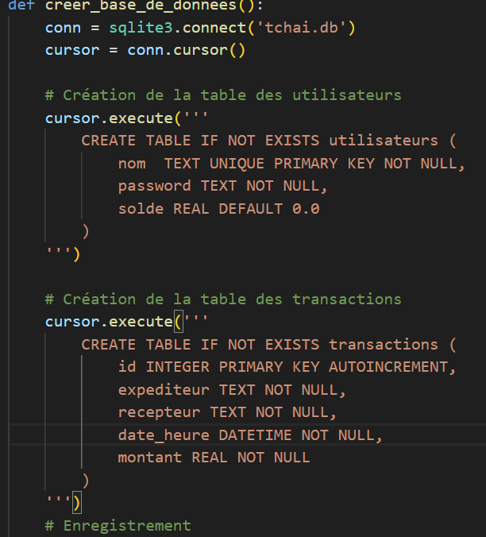
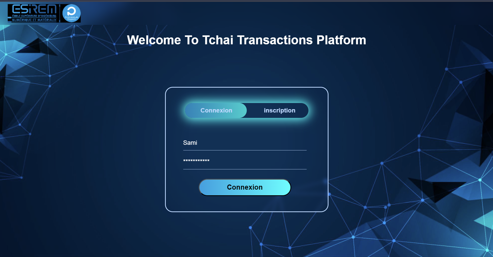
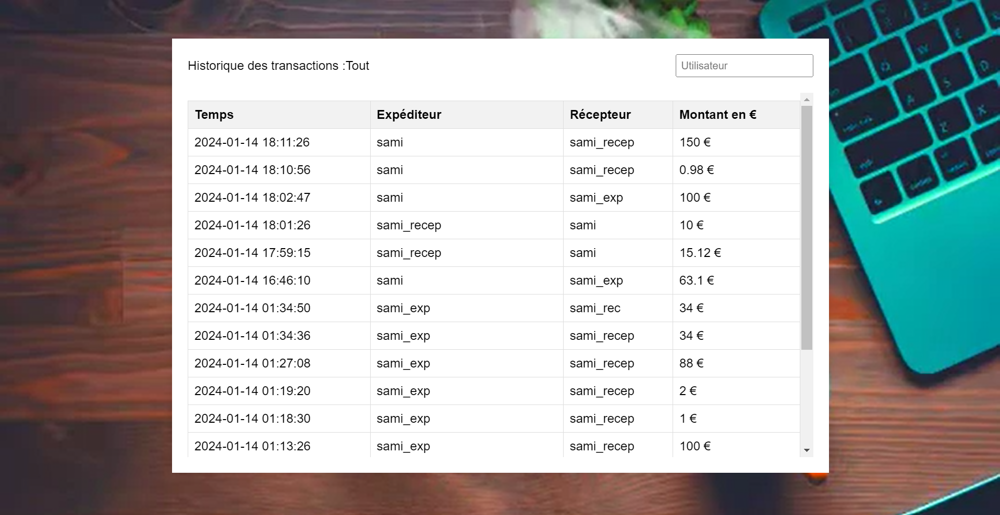
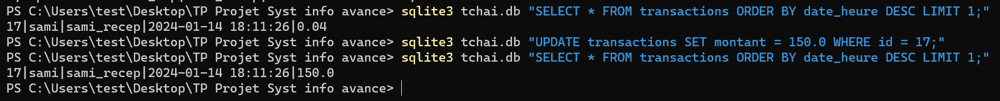

# TCHAI-SAMI-EZZAHID
Systèmes d’information avancés. Projet TP

# Systèmes d’information avancés - Projet TP

## Réalisé par : 
- **Sami EZZAHID** 
  - 5A - IE -ILC 
  - [sami_ezzahid@etu.bourgogne.fr](mailto:sami_ezzahid@etu.bourgogne.fr)

## Introduction

L'objectif de ce projet est de créer un logiciel de gestion de transactions électroniques avec une intégrité garantie, accessible via le protocole **HTTP**.

### Technologies Utilisées

- **Front-end :** HTML, CSS, JavaScript
- **Back-end :** Python, Flask
- **Base de Données :** SQLite

Les données sont enregistrées dans un fichier nommé "**tchai.db**".

## Tchaî V_1

### Exercice 1 : Fonctions Préliminaires

Une transaction est définie comme un tuplet (P1, P2, t, a), où a est la somme d’argent transférée de P1 à P2 au moment t.

#### (A0) : Page Connexion/Inscription

Nous commençons par définir une page de **connexion/inscription** pour enregistrer et identifier les utilisateurs avec les éléments suivants : 
- Un nom d'utilisateur.
- Un mot de passe.

Cette étape est essentielle pour initialiser les soldes des utilisateurs.

Voici la page de connexion/inscription qui permet de faire les deux tâches dans la même page grâce à un curseur :

#### (A1) - (A4) : Enregistrement d'une transaction 

Voici la page d'enregistrement des transactions :

La page d'enregistrement des transactions comprend :
- Un formulaire pour saisir le nom de l'expéditeur (prédéfini depuis la phase de connexion), le nom du récepteur et le montant de la transaction.
- Affichage du solde de l'utilisateur connecté.
- Bouton pour enregistrer la transaction.
- Bouton pour basculer vers la page d'affichage de l'historique des transactions.

Lorsque la fonction "enregistrerTransaction()" est déclenchée, les données sont récupérées depuis la page HTML et ensuite envoyées sous format JSON au serveur Flask grâce à une requête Fetch HTTP. La route Flask "route_transaction" récupère les données, vérifie si les noms entrés existent dans la table utilisateurs, puis met à jour le solde de chaque utilisateur et enregistre la transaction dans la table transactions.

#### (A2) - (A3): Affichage des transactions

Voici la page de l'historique des transactions :

La page affiche dans une table les données retournées par la route Flask "route_historique". La page possède également un input situé au-dessus de la table pour entrer le nom de l'utilisateur et filtrer les transactions affichées liées à un certain utilisateur.

Le code utilise la requête SQL suivante pour filtrer les données à sélectionner selon le nom d'utilisateur : 

cursor.execute('SELECT date_heure, expediteur, recepteur, montant FROM transactions WHERE expediteur = ? OR recepteur = ? ORDER BY date_heure DESC', (utilisateur, utilisateur))
        transactions = [{'date_heure': row[0], 'expediteur': row[1], 'recepteur': row[2], 'montant': row[3]} for row in cursor.fetchall()]

## Exercice 4 : Attaque de la base de données

- Nous utilisant le terminal pour se connecter à la bdd sqlite3 et récupérer une ligne pour determiner la valeur de la clé primaire. en suite , la requete suivant met ajour les données sans que cette fail soit detécter par notre système : 

## Tchaî V_2

## Exercice 6 : Hashage

